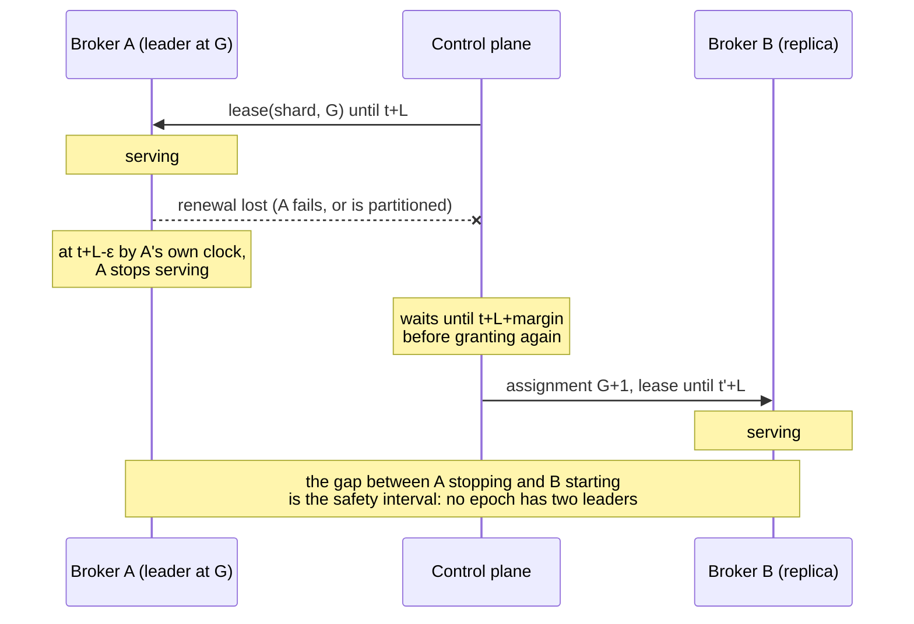

# Shard replication and leader failover

**Decision: leadership is a time-bounded lease issued by the control plane, and
replication is log shipping from the leader to its followers. Per-shard Raft is
rejected.**

Recorded for M5.1 (#110). The rejected alternative and what would overturn the
decision are both below.

## What has to be true

Constraints first, because the comparison is only meaningful against them.

**Safety.** At most one broker may commit writes for a shard at a given epoch,
under any combination of partition, pause, and clock error the failure model
admits. A record acknowledged under `Quorum` must survive any failure the
configured majority tolerates.

**Availability.** A shard survives its leader failing. It also survives the
control plane being briefly unreachable — a broker must not stop serving because
a metadata service restarted.

**Write latency.** A publish already crosses ingress, offset assignment,
durability, and fanout in a fixed order. Replication adds one network round trip
for `Quorum` and none for `Leader`. It must not add a *consensus* round trip to
the common path.

**Operational.** A broker holds many shards. Whatever runs per shard runs
hundreds or thousands of times per broker.

**Dependency.** The storage layer is fixed. Its invariants are load-bearing and
documented, and a replication design that violates them is not a replication
design, it is a storage rewrite.

## The constraint that decides it

`docs/storage-format.md` and `docs/durable-storage.md` state it plainly:

> **Records are never rewritten**, which is what lets recovery keep trusting
> "valid bytes end at EOF".

That single property is why torn-tail repair is sound, why a missing index can
be rebuilt, and why preallocation reserves blocks without changing `st_size`.

**Raft requires a leader to overwrite a follower's divergent uncommitted log
suffix.** That is not an incidental detail of Raft; it is how log matching is
achieved. A follower that accepted entries from a deposed leader must truncate
and re-accept.

So per-shard Raft over the stream log forces one of:

1. **Abandon the never-rewritten invariant.** Recovery can no longer trust that
   valid bytes end at EOF, because a truncation may have been interrupted.
   Torn-tail repair and interior-corruption detection both rest on that
   distinction, and both would need redesigning.
2. **Keep two logs** — a Raft log for consensus and the segment log for serving.
   Every record is written twice, and the two can disagree after a crash. That is
   a second durability path with its own recovery story, which is the thing the
   storage design most deliberately avoided having.

Neither is a tuning problem. Both are a different storage layer.

The storage layer was in fact built anticipating the other answer:
`docs/durable-storage.md` says "Replication (M5) is what `seal`'s checksum and
`read_range`'s bounded paging exist to serve." Sealed-segment checksums and
bounded range reads are the primitives of *shipping*, not of consensus.

## Why the control plane being Raft-backed does not settle this

M7 makes control-plane metadata highly available, and Raft is the right tool
there. It does not follow that payload replication should use Raft, and the
issue asks for this to be said explicitly.

The two have opposite cost profiles:

| | Control-plane metadata | Stream payload |
| --- | --- | --- |
| Volume | Assignments, tenants, streams — kilobytes, changing rarely | The entire data plane |
| Groups | One, for the cluster | One per shard: hundreds or thousands per broker |
| What consistency buys | Linearizable reads of small state everyone must agree on | Durability of records already ordered by a single writer |
| Cost of a round trip | Paid once per metadata change | Paid on every publish |

A stream's records are already totally ordered by their leader. Consensus is not
being asked to *establish* an order — the log has one. It is being asked to
replicate an existing order durably. That is a weaker requirement than Raft
solves, and paying Raft's price for it is paying for agreement that has already
happened.

## The selected design

### Leases

The control plane grants a **lease** on `(shard, generation)` to one broker for a
bounded duration `L`. The lease is the authority to serve; the assignment alone
is not.

A lease is bound to the generation. A new generation is a new lease, never a
renewal of the old one — which is what makes generation the epoch that fences
writes.

The leader renews through the heartbeat it already sends. A renewal that does not
arrive before expiry means the lease lapses; nothing revokes it explicitly,
because a revocation cannot be delivered to a partitioned broker, which is
precisely the case that matters.

### The exact condition under which a broker may accept a write

A broker may accept a write for shard `S` if and only if **all** of:

1. It holds a lease for `S` at generation `G`.
2. Its own monotonic clock reads earlier than `expiry(G) − ε`, where `ε` covers
   clock drift and the time between this check and the record reaching disk.
3. Its local shard state for `S` is open at exactly generation `G` — the check
   `IngressRouter::dispatch` already performs.
4. For a `Quorum` stream, a majority of the replica set for `G` **including the
   leader** has durably stored the record. For a `Leader` stream, the leader's
   own configured durable commit point has been reached.

Conditions 1–3 are checked **twice**: once when the request is admitted, and
again immediately before the record is committed to the log. The second check is
not redundant. Everything between them can take arbitrarily long — a full ingress
queue, a slow fsync, a VM pause — and a lease that was valid on admission may
have expired by the time the bytes reach the disk. Fencing only at the routing
boundary leaves exactly the window this design exists to close.

### Failover

1. The lease lapses (no renewal within `L`).
2. The control plane selects an eligible replica: one whose durable high-water
   mark is within the configured catch-up bound of the last known committed
   offset.
3. It publishes assignment generation `G+1` naming that replica as leader, and
   grants it a lease.

The control plane must not publish `G+1` before it is certain no broker can still
believe it holds `G`. With lease duration `L` granted at control-plane time `t`,
`G+1` may be granted no earlier than `t + L + margin`, where `margin` covers
clock drift between the two parties and the network delay of the grant itself.
The leader stops at `t + L − ε` by its own clock. The gap between those two
instants is the safety interval, and it is why leases are safe without
synchronized clocks.

The safety interval is the whole mechanism, so it is worth seeing:

Nothing in that sequence requires A and CP to agree on the time. It requires only
that neither clock runs more than `ρ` faster or slower than real time, so the two
instants cannot cross.

### The clock assumption, stated precisely

Safety requires a bound on clock **drift rate**, not synchronized clocks. For any
two nodes, over a real interval `T`, each monotonic clock advances by between
`T(1−ρ)` and `T(1+ρ)` for a known `ρ`.

This is a real assumption and it can be violated. The realistic violation is not
NTP error — it is **process suspension**: a VM migration, a stop-the-world pause,
a throttled container. A broker suspended past its expiry wakes believing it
still holds a lease.

That is exactly why condition 2 is re-checked at the durable-append boundary
rather than only at admission. A suspended broker's next check is after it wakes,
and it sees an expired lease before its bytes reach disk. A suspension *between*
that check and the write completing is bounded by `ε`, which is the parameter to
tune, and the residual risk to state honestly rather than claim away.

### Replication

The leader ships committed records to followers over the internal transport that
already exists (#105), append-only. A follower never truncates a record it has
durably stored, because the leader only ships records it has committed, and a
committed record is never un-committed: it was ordered by a leader that held an
unexpired lease, and no other leader existed at that epoch.

That is the property Raft has to work for and leases give directly, and it is why
the never-rewritten invariant survives.

Catch-up for a new or lagging follower is a bounded `read_range` from the leader,
with sealed-segment checksums to verify wholesale rather than record by record —
the primitives the storage layer already exposes for this purpose.

### The `Leader` loss window, precisely

For `ConsistencyLevel::Leader`, a record is acknowledged once it is durable on
the leader alone. If the leader's storage is permanently lost, records
acknowledged but not yet shipped are lost.

The window is bounded by the leader's **replication lag**: the byte range between
its durable high-water mark and the lowest follower's acknowledged mark. It must
be exported as a metric, because a bound nobody can observe is not a bound. An
operator choosing `Leader` is choosing this window, and must be able to see how
large it currently is.

`Quorum` has no such window: a majority including the leader holds every
acknowledged record, so any failure within the configured majority preserves it.

## Failure model

| Situation | Behaviour |
| --- | --- |
| Leader fails | Lease lapses; a caught-up replica is promoted at `G+1` after the safety interval. Unavailable for at most `L + margin + promotion`. |
| Leader partitioned from the control plane | Keeps serving until its lease expires, then stops. A brief control-plane outage costs nothing; a long one costs availability, not safety. |
| Leader partitioned from followers | `Quorum` writes fail — correctly, the majority is unreachable. `Leader` writes succeed and accumulate loss-window exposure, which the lag metric shows. |
| Control plane unavailable | No new leases are granted. Existing leases run to expiry, then shards go unavailable. Deliberate: granting without a functioning authority is how split-brain happens. |
| Broker suspended past expiry | Refused at the durable-append check on waking. |
| Stale broker after reassignment | Its lease has expired, so it refuses. This is what closes #239 by construction rather than by racing a watch. |

## What this does to the other M5 issues

- **#111 (fenced leadership)** — this is now specific: the epoch is the
  assignment generation, the fence is the lease, and it is enforced at both the
  routing and durable-append boundaries. **#239 is subsumed**: a stale ex-owner is
  a broker without a valid lease, and the same check refuses it.
- **#112 (replicate records)** — append-only shipping, not a consensus log. The
  catch-up path is `read_range` plus sealed-segment checksums.
- **#113 (Leader and Quorum)** — the majority is over the replica set *of the
  current generation*, and an acknowledgement from a replica at an older
  generation does not count toward it.
- **#114 (bootstrap followers)** — bounded range reads from the leader; no
  snapshot-install protocol is needed, because the log is the snapshot.
- **#115 (failure injection)** — needs lease expiry, clock skew, and suspension
  as injectable faults, not just process kills. The harness can stop and move a
  broker today (#108); it cannot yet pause one or skew its clock.
- **#116 (semantics)** — must document the `Leader` loss window in terms of the
  lag metric, and state that `Quorum` is majority-including-leader.

## What would overturn this

Stated because a decision without one is an opinion.

**Raft's real advantage is that it needs no clock assumption for safety.** Leases
trade that for a simpler data path. If Felix ever needs to run where drift rate
cannot be bounded — or where process suspension is common enough that `ε` cannot
be chosen — that trade stops being worth it.

The other trigger is the storage layer changing. The argument above rests on
"records are never rewritten." If that invariant is ever relaxed for another
reason, Raft's cost drops sharply and this should be revisited rather than
inherited.

What is *not* a reason to revisit: throughput. Leases were not chosen because
they are faster in the common case. `Quorum` pays one round trip either way, and
the difference between designs is at failover and in the storage layer, not in
steady-state publish latency.
