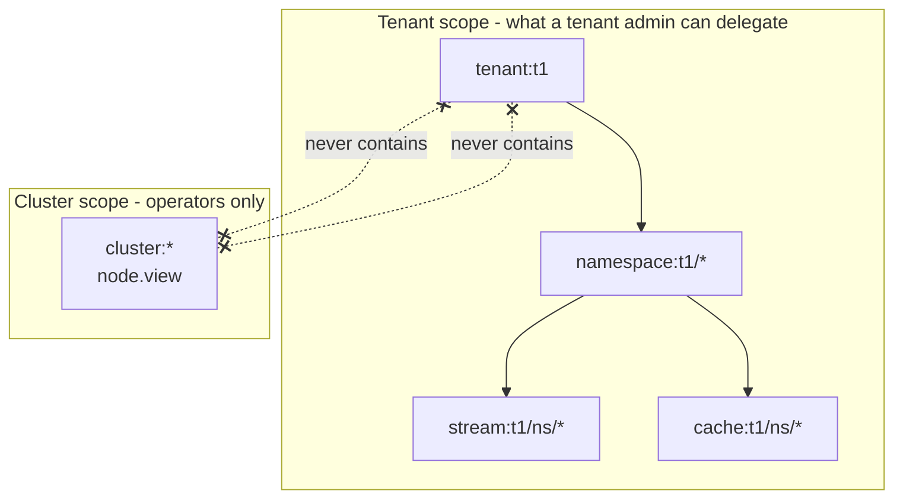

# RBAC Model (Control Plane)

This document describes Felix RBAC mutation and delegation semantics.

## Security Goals

- Keep policy evaluation simple and predictable (allow rules only).
- Prevent privilege escalation by enforcing scope containment at write time.
- Separate RBAC-administration permissions from resource-operation permissions.
- Keep tenant boundaries explicit in every object string.

## Actions

Canonical actions:
- `rbac.view`
- `rbac.policy.manage`
- `rbac.assignment.manage`
- `tenant.manage`
- `ns.manage`
- `stream.manage`
- `cache.manage`
- `stream.publish`
- `stream.subscribe`
- `cache.read`
- `cache.write`
- `node.view` — cluster-scoped only; see [Cluster scope](#cluster-scope)
- `node.manage` — over `node:{node_id}` or `cluster:*`

## Object Grammar

Valid canonical objects:
- `tenant:{tenant_id}`
- `namespace:{tenant_id}/{namespace}`
- `stream:{tenant_id}/{namespace}/{stream}`
- `cache:{tenant_id}/{namespace}/{cache}`

Allowed wildcards:
- `namespace:{tenant_id}/*`
- `stream:{tenant_id}/{namespace}/*`
- `cache:{tenant_id}/{namespace}/*`

### Cluster scope

A permission is only writable when its object already sits inside the writer's
own scope. The two crossed links are the whole security property: because no
arrow runs between them, a tenant admin cannot write themselves `cluster:*`, and
cluster scope cannot read tenant data.

One object sits outside the tenant hierarchy:

- Cluster: `cluster:*` — broker membership, liveness, and placement standing.

It is an island in both directions, and that is the whole security property:

- **No tenant scope contains it.** A policy write is admitted only when its
  object is already inside the caller's scope, so a tenant admin cannot grant
  themselves `cluster:*`. Nothing in the bootstrap seed grants it either.
- **It contains no tenant object.** Cluster scope confers nothing inside a
  tenant, so it is not a backdoor into tenant data.

`node.view:cluster:*` is required by `GET /v1/nodes` and `GET /v1/nodes/{node_id}`.
The tenant comes from the token's own `tid` claim rather than a path segment,
because the cluster is not a tenant resource; that claim only selects which
tenant's signing keys to verify against, exactly as `kid` selects a key without
conferring one.

`cluster:*` is the only accepted spelling. `cluster:nodes` and a bare `cluster:`
are rejected, so a typo is refused rather than silently scoped.

Rejected on writes:
- `tenant:*`
- `stream:*` / `stream:*/*`
- `cache:*` / `cache:*/*`
- any malformed or cross-tenant object

HTTP semantics:
- `400` invalid grammar/action/payload
- `401` missing or invalid bearer token
- `403` caller authenticated but lacks required scope/action

## Delegated RBAC Admin

RBAC endpoints are authorized only by RBAC admin actions:
- list policies/groupings: `rbac.view`
- mutate policies: `rbac.policy.manage`
- mutate assignments: `rbac.assignment.manage`

Delegation safety rule:
- Caller can only mutate policies/assignments whose target objects are within the caller's scope.
- Caller cannot assign a role if any policy on that role exceeds caller scope.

Admin scope examples:
- `rbac.policy.manage:tenant:t1`
  - can create `namespace:t1/*`, `stream:t1/payments/*`, `cache:t1/payments/sessions`
  - cannot create `tenant:*` or any `t2` object
- `rbac.policy.manage:namespace:t1/payments`
  - can create stream/cache policies only under `payments`
  - cannot create `namespace:t1/orders` or `tenant:t1`
- `rbac.policy.manage:stream:t1/payments/orders`
  - can only manage that single stream object
  - cannot create `stream:t1/payments/*`

Examples:
- `rbac.policy.manage:namespace:t1/payments` can manage rules in `payments` only.
- `rbac.policy.manage:stream:t1/payments/orders` cannot grant `stream:t1/payments/*`.
- `rbac.policy.manage:tenant:t1` can manage tenant `t1` RBAC, but still cannot use `tenant:*`.

## Notes

- Strict grammar is enforced for RBAC evaluation and writes.
- Group-claim RBAC is evaluated at token exchange by materializing transient
  `principal -> group:*` links before Casbin permission expansion.
