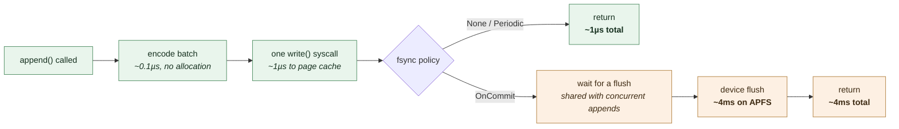

# Durable Storage Performance

What durability costs, measured rather than argued, plus the regression budget
the durable log is held to.

Reproduce everything here with:

```sh
scripts/bench-durable-log.sh results.jsonl
```

## How the log is built for speed

Seven techniques, each taken from a log-structured engine that has already paid
for the lesson. They are listed in rough order of how much they matter.

### 1. Group commit — the single largest lever

An `fsync` flushes the *whole file*, not one caller's bytes. So when N appends
are in flight, one flush can satisfy all N. Every appender contends for the same
flush lock; the winner flushes, and the losers wake to find their target already
durable and return without flushing again.

Measured below: 253 durable appends/second at concurrency 1, 14,387 at
concurrency 64. Same code, same disk, **57× the throughput**, purely from not
making each append buy its own device flush.

This is the mechanism behind PostgreSQL's `commit_delay`, MySQL's binlog group
commit, and RocksDB's WAL group commit. `felix_storage_sync_batch_appends`
reports the fan-in actually achieved — a value near 1 under concurrent load means
appends are serialising on the device and something has regressed.

### 2. One `write` per batch, not per record

Records are encoded into a reusable staging buffer and handed to the kernel in a
single `write`. At 128-byte payloads the syscall, not the copy, is what costs —
which is why batching 16 records per append is worth 4.8× to 16× the throughput
of batching one, across every row below. The gain is largest under `on_commit`
(13–16×), where a batch amortises a device flush as well as a syscall, and
smallest for a single `none` publisher (4.8×), where there was little syscall
overhead to remove in the first place.

### 3. Writes and flushes are separate operations

A `write` lands in the page cache and is cheap; only `fsync` touches the device.
Keeping them apart is what makes group commit expressible at all, and it is why
`None` and `Periodic` can acknowledge in ~1µs.

### 4. Positioned reads (`pread`)

A `seek` + `read` pair mutates the file cursor, so a shared descriptor cannot
serve two readers at once and every read costs an extra syscall. `pread` takes
the offset as an argument: one descriptor per segment serves any number of
concurrent readers with no lock. Kafka, RocksDB and LevelDB all do this on their
immutable files.

### 5. Preallocation

Appending past end of file makes the filesystem allocate blocks and update the
inode's block map on the write path, and invites fragmentation as segments from
different shards interleave. `fallocate(FALLOC_FL_KEEP_SIZE)` on Linux and
`F_PREALLOCATE` on macOS reserve the blocks up front without changing the file's
logical length — so recovery's "valid bytes end at EOF" reasoning still holds.

### 6. Sparse indexes

One entry per `index_spacing_bytes`. A read binary-searches the entries, then
scans forward at most one interval. Locating an offset is `O(log n)` plus a
bounded read, instead of a scan from the head of the log.

### 7. `fdatasync` over `fsync`

An append changes file data and size, not the owner, mode or times a full `fsync`
also flushes. On macOS this is `F_FULLFSYNC` instead — POSIX `fsync` there leaves
data in the drive's volatile cache, so anything weaker would be measuring a
promise the platform does not keep.

## Where the time goes



Roughly four thousand times separates "in the page cache" from "on the device"
— about 1µs against about 4ms. Nothing in the code can close that gap; group
commit exists to *amortise* it.

## Measured results

**Hardware and configuration.** Apple Mac Studio (`Mac16,9`), Apple M4 Max,
16 CPUs, macOS 26.6.1 (Darwin 25.6.0), APFS on internal NVMe. 128-byte payloads,
8,000 measured records per run after a 2,000-record warm-up, 64 MiB segments,
4 KiB index spacing, preallocation on. `felix-log-tool bench`, release profile.
Latencies are per `append` call, so at batch 16 one sample covers 16 records.

| Policy | Batch | Concurrency | Records/s | p50 | p99 | p999 |
| --- | ---: | ---: | ---: | ---: | ---: | ---: |
| `none` | 1 | 1 | 571,898 | 1µs | 2µs | 5µs |
| `none` | 1 | 8 | 252,825 | 3µs | 391µs | 730µs |
| `none` | 1 | 64 | 255,997 | 3µs | 787µs | 1.5ms |
| `none` | 16 | 1 | 2,768,326 | 3µs | 4µs | 8µs |
| `none` | 16 | 8 | 2,121,453 | 51µs | 337µs | 738µs |
| `none` | 16 | 64 | 1,843,566 | 5µs | 1.7ms | 2.2ms |
| `periodic` (250ms) | 1 | 1 | 492,106 | 1µs | 3µs | 7µs |
| `periodic` | 1 | 8 | 272,182 | 3µs | 413µs | 927µs |
| `periodic` | 1 | 64 | 267,180 | 3µs | 955µs | 2.6ms |
| `periodic` | 16 | 1 | 2,671,267 | 3µs | 5µs | 8µs |
| `periodic` | 16 | 8 | 1,990,194 | 57µs | 261µs | 690µs |
| `periodic` | 16 | 64 | 1,854,732 | 129µs | 255µs | 284µs |
| `on_commit` | 1 | 1 | 253 | 3.99ms | 6.0ms | 10.7ms |
| `on_commit` | 1 | 8 | 2,006 | 3.99ms | 6.9ms | 8.3ms |
| `on_commit` | 1 | 64 | 14,387 | 4.07ms | 8.6ms | 9.2ms |
| `on_commit` | 16 | 1 | 4,038 | 3.96ms | 6.5ms | 9.7ms |
| `on_commit` | 16 | 8 | 28,670 | 4.00ms | 9.8ms | 12.1ms |
| `on_commit` | 16 | 64 | 185,905 | 4.96ms | 8.1ms | 9.2ms |

**Recovery is fast enough not to shape restart planning.** A 1.01 GiB active
segment - 7,000,000 records - is fully validated in 0.32s, about 3.2 GiB/s.
Since only the active segment is scanned in full, restart cost is bounded by
`segment_size_bytes` rather than by total data on disk: at the 256 MiB default,
that is under a tenth of a second.

### What this says

**Durability is free until you ask for the device.** `none` and `periodic` are
within noise of each other — the periodic flush runs off the append path, so its
cost does not appear in append latency at all. A durable stream on `periodic`
costs roughly what a non-durable one costs, plus the storage write itself.

**`OnCommit` latency is a hardware constant.** p50 sits at ~4ms in every single
row, from concurrency 1 to 64 and from batch 1 to 16. That is one APFS device
flush. No amount of software makes a single durable commit faster than the
device; the only variable is how many commits share one.

**Throughput under `OnCommit` scales almost linearly with concurrency.**
253 → 2,006 → 14,387 records/second at concurrency 1 → 8 → 64. Combined with
batching, 185,905 records/second — over 700× the single-publisher number, on the
same disk, with the same guarantee.

**Tail latency degrades with concurrency for the cheap policies.** `none` at
concurrency 64 shows p999 of 1.5ms against 5µs at concurrency 1.

The likely cause is contention on the segment write lock rather than I/O —
appends must assign offsets in order, and `none` does no device work to hide
behind — but that is an inference from the shape of the numbers, not something
measured. Confirming it needs lock-wait instrumentation on the append path,
which does not exist yet. It matters for high-fanout publishers on non-durable
streams and is the most likely place a future optimisation pays off.

## Regression budget

CI does not yet gate on these. They are the numbers a change should be measured
against, and a breach is a design conversation rather than an automatic failure.

| Guard | Budget | Rationale |
| --- | --- | --- |
| `none` / `periodic` p999, batch 1, concurrency 1 | ≤ 25µs | 3–5× the measured 5–7µs. Anything worse means the non-durable path picked up real work |
| `none` / `periodic` throughput, batch 1, concurrency 1 | ≥ 300k records/s | ~60% of measured. Guards against a per-record syscall or allocation creeping in |
| `on_commit` p50 | ≤ 1.5× one device flush | The floor is hardware. Exceeding it means an append is buying more than one flush |
| `on_commit` throughput at concurrency 64 | ≥ 40× the concurrency-1 figure | Group commit is the design. Falling toward 1× means the flush lock has stopped batching |
| `felix_storage_sync_batch_appends` under concurrent load | ≥ 8 | Direct measurement of the above; alertable in production |
| Batch-16 throughput vs batch-1 | ≥ 4× | Confirms one `write` per batch, not per record |
| Recovery time | ≤ 1s per GiB of active segment | Measured at 0.32s for a 1.01 GiB segment (~3.2 GiB/s), so the budget carries about 3× headroom. Only the active segment is fully scanned |

### Operating envelope

| If you need | Choose | Expect |
| --- | --- | --- |
| Lowest latency, loss acceptable on machine failure | `none` | ~1µs p50, ~500k records/s single publisher |
| A bounded loss window, latency unchanged | `periodic { 250ms }` | ~1µs p50; up to 250ms of writes at risk |
| No loss of an acknowledged record | `on_commit` | ~4ms p50 per publisher; scale with concurrency and batching |

`periodic` is the default because it is the only one of the three whose cost is
invisible on the append path while still bounding loss.

## Reading this before M5

Replication compounds the flush cost: a quorum write is at minimum one local
flush plus a network round trip to a follower that is also flushing. Two
consequences follow from the numbers above and should shape M5's design rather
than be discovered during it:

1. **Per-record replication is not viable at `on_commit`.** At 253 durable
   appends/second per publisher, a design that flushes once per replicated record
   caps a node in the low hundreds of writes/second. Replication must batch, and
   the batch must span publishers — the same argument that produced group commit
   locally.
2. **The follower's flush should overlap the leader's, not follow it.** Serialising
   them doubles a 4ms constant. Group commit already proves the machinery for
   fanning one flush out to many waiters; the replication path should reuse it
   rather than invent a second one.

## Methodology notes

- **Warm-up is mandatory.** The first appends pay for segment creation,
  preallocation and page-cache faults. `--warmup-records` defaults to 2,000 and
  those samples are discarded.
- **Each run gets a fresh directory.** Reusing one lets an earlier run's segments
  and page-cache residency skew the next.
- **Throughput is measured after a final flush.** A policy that leaves data in
  the page cache has not finished its work when the last append returns.
- **Percentiles are nearest-rank** over every `append` call, not interpolated.
- **The environment is recorded in the output.** A latency figure without the
  filesystem and device it came from is not reproducible, and that is the most
  common way benchmark results become unusable six months later.
- **These are storage-layer numbers**, measured against `DiskLog` directly. They
  exclude QUIC, framing and fanout. The end-to-end broker figures come from
  `latency-demo` and are a separate measurement.
